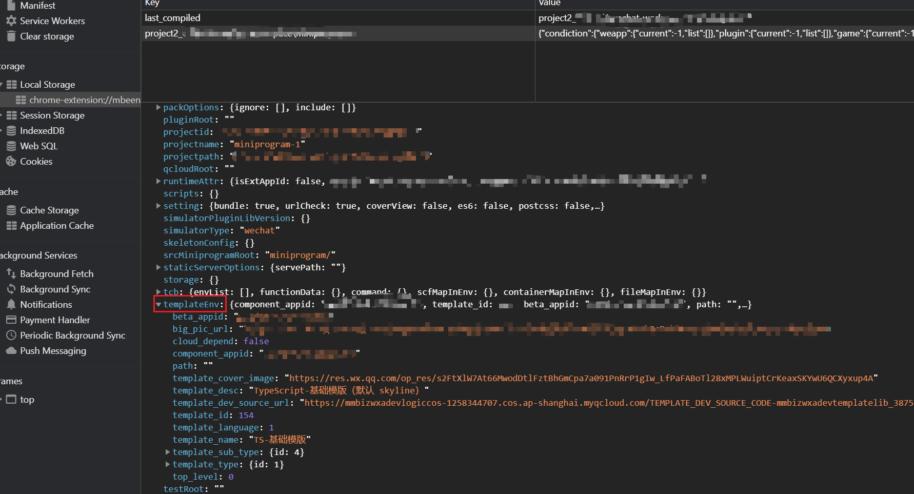

Recently, I got a chance to use Wechat DevTools to develop some mini-programs. Then found some problems during development that I want to take a note, the version I am using is `1.06.2412050`.

## 1. Cannot download base library

Network problem is always the headache. So need to check below parts:

### Domain block

Make sure all the [required domains](https://wechat-miniprogram.github.io/minigame-unity-webgl-transform/Design/DevtoolsDomain.html) are unblocked.

### Self-signed certificate issue

This problem happens when using the company intranet because some company intranet will intercept all the network and signed by their own self-signed certificate.

Wechat DevTools uses NW.js and use `request` npm lib to download the base library. Wechat DevTools cannot customize the trusted CA for `request` right now, so the possible solution is leveraging node environment variables:

1. `NODE_EXTRA_CA_CERTS` **cannot work** here because NW.js is different than Nodejs, it's like some wrapper for Nodejs, so the current supported Nodejs environment variables are limited.
1. **`NODE_TLS_REJECT_UNAUTHORIZED`** can work, so there are two ways to set in the Wechat DevTools
   - Set from the Wechat DevTools console manually, click button `Debug Wechat DevTools` or `F12` to open the debug devtools, then add below code in the console
   ```javascript
   process.env.NODE_TLS_REJECT_UNAUTHORIZED = 0
   ```
   - Set this variable from the shortcut
   ```bash
   cmd.exe /c "set NODE_TLS_REJECT_UNAUTHORIZED=0&& "C:\Program Files (x86)\Tencent\微信web开发者工具\微信开发者工具.exe"
   ```

## 2. Cannot update the default Typescript typings

From the [official document](https://developers.weixin.qq.com/miniprogram/dev/devtools/compilets.html#TS%E5%A3%B0%E6%98%8E%E6%96%87%E4%BB%B6%E6%9B%B4%E6%96%B0), the way to update the Typescript typings is just clicking the button from the context menu like below.


But when importing the existing mini-programs, found that this update will always fail. After some test, found that the easy way to **reproduce** this issue is:

1. Create a new mini-program with typescript template from Wechat DevTools.
1. Delete this mini-program without removing all the source code from the Wechat DevTools.
1. Import in the Wechat DevTools again.
1. Try to update the Typescript typings from context menu at this time.

So after some debugging, found that the problem was caused by the following code:

```
// from 'core.wxvpkg'
checkProjectUseTS(e) {
    var t, i, s;
    return !(!e.templateEnv || (null === (t = e.templateEnv) || void 0 === t ? void 0 : t.hybirdPluginId) || (null === (i = e.templateEnv) || void 0 === i ? void 0 : i.isWeDa)) && l.includes(null === (s = e.templateEnv) || void 0 === s ? void 0 : s.template_language)
}
```

So the key here is the `templateEnv` variable, which will be only initialized and saved to local storage when creating a new mini-program with template from Wechat DevTools.


So the **solution** is:

- don't use the default TS typings, use the official npm package - [miniprogram-api-typings](https://github.com/wechat-miniprogram/api-typings) to manage all the typings manually
